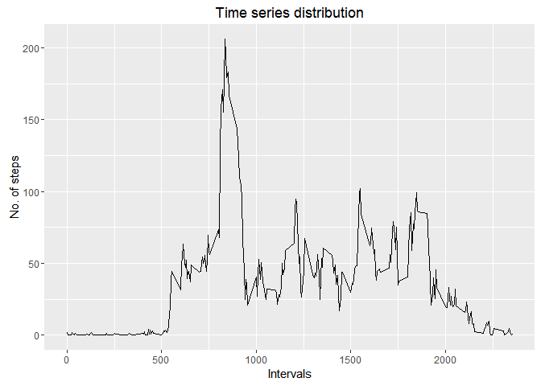

# FitnessMonitorAnalysis
NishaK  
9 January 2016  

The aim is to analyze data of a personal activity device collected at a period of 2 months at 5 day interval 

###Importing the data
This part of the code will import the raw data and remove records missing values

```r
mdatatotal<-read.csv("C:/Users/tittyni/Misc/DataScience/Reproducible Research/RepData_PeerAssessment1/activity.csv")
mdata<-subset(mdatatotal,!is.na(mdatatotal$steps))
```

###Histogram of the total number of steps taken each day, mean and median number of steps taken each day

The code below will create a total of no. of steps walked per day and a histogram that plots the same.

```r
StepsPerDay<-aggregate(mdata$steps~mdata$date,mdata,sum)
library("ggplot2")
qplot(StepsPerDay$`mdata$steps`,geom = "histogram",main="Distribution of steps walked each day"
      ,xlab="No. of steps per day",ylab="Frequency of days",col=I("blue"),fill=I("Green"))
```

```
## `stat_bin()` using `bins = 30`. Pick better value with `binwidth`.
```

\

Below code shows a set of 10 values of mean and median of total no. of steps taken per day per day

```r
StepsCount_Mean<-aggregate(StepsPerDay$`mdata$steps`~StepsPerDay$`mdata$date`,StepsPerDay,mean)
StepsCount_Median<-aggregate(StepsPerDay$`mdata$steps`~StepsPerDay$`mdata$date`,StepsPerDay,median)
head(StepsCount_Mean,10)
```

```
##    StepsPerDay$`mdata$date` StepsPerDay$`mdata$steps`
## 1                2012-10-02                       126
## 2                2012-10-03                     11352
## 3                2012-10-04                     12116
## 4                2012-10-05                     13294
## 5                2012-10-06                     15420
## 6                2012-10-07                     11015
## 7                2012-10-09                     12811
## 8                2012-10-10                      9900
## 9                2012-10-11                     10304
## 10               2012-10-12                     17382
```

```r
head(StepsCount_Median,10)
```

```
##    StepsPerDay$`mdata$date` StepsPerDay$`mdata$steps`
## 1                2012-10-02                       126
## 2                2012-10-03                     11352
## 3                2012-10-04                     12116
## 4                2012-10-05                     13294
## 5                2012-10-06                     15420
## 6                2012-10-07                     11015
## 7                2012-10-09                     12811
## 8                2012-10-10                      9900
## 9                2012-10-11                     10304
## 10               2012-10-12                     17382
```

###Time series plot of the average number of steps taken

The code and plot below show distribution of average no. of steps taken with respect to interval.

```r
DailyMean<-aggregate(mdata$steps~mdata$interval,mdata,mean)
DailyMean<-data.frame(DailyMean)
names(DailyMean)[names(DailyMean)=="mdata.interval"] <- "Interval"
names(DailyMean)[names(DailyMean)=="mdata.steps"] <- "MeanOfSteps"
ggplot(DailyMean, aes(Interval, MeanOfSteps)) + geom_line() + xlab("Intervals") + ylab("No. of steps") +
  ggtitle("Time series distribution")
```

\

This code will show the entry that has highest of average steps taken

```r
MaxOfSteps<-subset(DailyMean,DailyMean$MeanOfSteps==max(DailyMean$MeanOfSteps))
names(MaxOfSteps)[names(MaxOfSteps)=="MeanOfSteps"] <- "MaxOfAverageSteps"
MaxOfSteps
```

```
##     Interval MaxOfAverageSteps
## 104      835          206.1698
```

###Code to describe and show a strategy for imputing missing data
Total data missing regarding no. of steps

```r
sum(is.na(mdatatotal$steps))
```

```
## [1] 2304
```

Lets calculate mean value of steps column, create a new data set equivalent to original and replace it with missing values 

```r
newmdatatotal<-mdatatotal
a<-is.na(newmdatatotal$steps)
avgdata<- tapply(newmdatatotal$steps, newmdatatotal$interval, mean, na.rm=TRUE, simplify=TRUE)
newmdatatotal$steps[a] <- avgdata
```
###Histogram of the total number of steps taken each day after missing values are imputed

```r
StepsPerDay1<-aggregate(newmdatatotal$steps~newmdatatotal$date,newmdatatotal,sum)
StepsPerDay1<-data.frame(StepsPerDay1)
names(StepsPerDay1)[names(StepsPerDay1)=="newmdatatotal.date"] <- "Date"
names(StepsPerDay1)[names(StepsPerDay1)=="newmdatatotal.steps"] <- "TotalSteps"

qplot(StepsPerDay1$TotalSteps,geom = "histogram",main="Distibution of steps walked each day (with imputed values)"
      ,xlab="No. of steps per day",ylab="Frequency of days",col=I("blue"),fill=I("Green"))
```

```
## `stat_bin()` using `bins = 30`. Pick better value with `binwidth`.
```

\

Code and result showing mean and median steps taken per day

```r
mean(StepsPerDay1$TotalSteps)
```

```
## [1] 10766.19
```

```r
median(StepsPerDay1$TotalSteps)
```

```
## [1] 10766.19
```

Code to create factor variable of categories weekdays and weekend

```r
newmdatatotal$date<-as.Date(as.character(newmdatatotal$date))
newmdatatotal$day<-weekdays(newmdatatotal$date)
newmdatatotal$weekday<- as.factor(c("weekend", "weekday"))
newmdatatotal[newmdatatotal$day == "Sunday" | newmdatatotal$day == "Saturday" ,5]<- factor("weekend")
newmdatatotal[!(newmdatatotal$day == "Sunday" | newmdatatotal$day == "Saturday"),5 ]<- factor("weekday")
```
###Panel plot comparing the average number of steps taken per 5-minute interval across weekdays and weekends

```r
library(lattice)
interval <- aggregate(steps ~ interval + weekday, newmdatatotal, mean)
xyplot(steps ~ interval | weekday, data=interval, layout=c(1,2), type='l')
```

\
